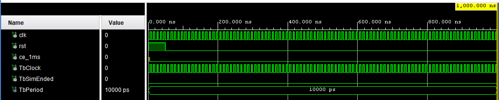
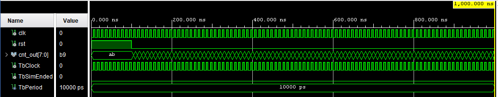
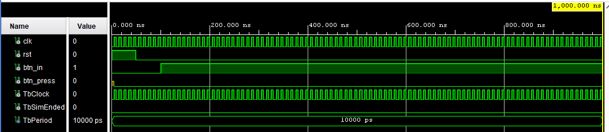
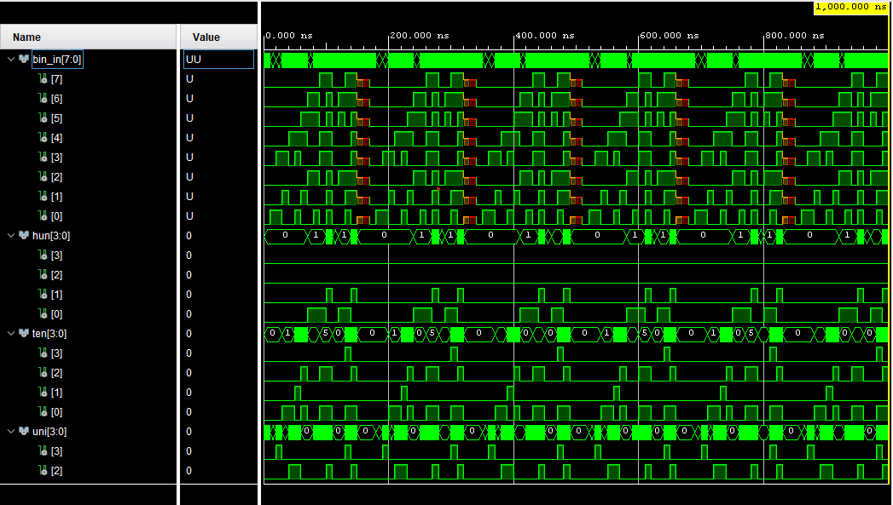
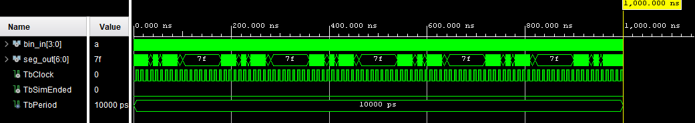
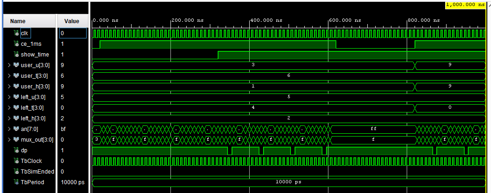

# Simulation Testbenches — `Binary_Perception_Game.srcs/sim_1/new/`

This directory contains VHDL behavioural testbenches for every synthesisable component of the Binary Perception Game. All simulations run in **Vivado XSim**. Pre-configured Tcl launch scripts and saved waveform databases (`.wdb`) are stored in `Binary_Perception_Game.sim/sim_1/behav/xsim/`.

📁 [Root README](../../../README.md) · 📁 [Sources README](../../sources_1/new/README.md)

---

## Testbench Overview

| Testbench | Entity under test | Tcl script |
|-----------|------------------|------------|
| `clk_en_tb.vhd` | `clk_en` | `cfg_tb_clk_en.tcl` |
| `counter_tb.vhd` | `counter` | `cfg_tb_counter.tcl` |
| `debounce_tb.vhd` | `debounce` | `cfg_tb_debounce.tcl` |
| `bin_2_bcd_tb.vhd` | `bin_2_bcd` | `cfg_tb_bin_2_bcd.tcl` |
| `bin_2_seg_tb.vhd` | `bin_2_seg` | `cfg_tb_bin_2_seg.tcl` |
| `Main_Game_Logic_tb.vhd` | `Main_Game_logic` | `tb_Main_Game_logic.tcl` |
| `Multiplexor_tb.vhd` | `Multiplexor` | `tb_Multiplexor.tcl` |

---

## Running a Simulation in Vivado

**GUI:**
1. Open `Binary_Perception_Game.xpr` in Vivado 2025.2
2. In **Sources → Simulation Sources → sim_1**, right-click the desired `_tb` file → **Set as Top**
3. Click **Run Simulation → Run Behavioral Simulation**
4. In the XSim waveform viewer press **Run All**

---

## Testbench Details

---

### `clk_en_tb.vhd` — Clock Enable Generator

**What is tested:** `ce_1ms` pulse period is exactly 1 ms (100 000 clock cycles at 100 MHz); pulse width is exactly 1 clock cycle; asserting `rst` mid-count restarts the period cleanly from zero.

**Stimulus:**
```
  0 ns  : rst = '1'
100 ns  : rst = '0'  →  counter starts
  1 ms  : expect first  ce_1ms pulse (width = 1 cycle)
  2 ms  : expect second ce_1ms pulse
500 µs  : mid-count rst = '1', then '0'  →  verify period restarts
```



*The waveform shows the 100 MHz `clk`, the internal divider count, and the single-cycle `ce_1ms` pulses at exact 1 ms intervals. After the mid-simulation reset, the interval restarts correctly from the point of release.*

---

### `counter_tb.vhd` — Free-Running 8-bit Counter

**What is tested:** Counter increments every clock cycle, wraps from 255 back to 0 without missing a value, and returns to 0 synchronously on `rst`.

**Key checks:**
- After exactly 256 rising edges from reset, `cnt_out` returns to `0x00`
- Asserting `rst` at any mid-count value returns output to `0x00` on the very next rising edge
- No values are skipped or repeated



*The waveform shows `cnt_out` counting up in hexadecimal, the wrap-around from `0xFF → 0x00`, and the immediate effect of a mid-count `rst` assertion.*

---

### `debounce_tb.vhd` — Button Debouncer

**What is tested:** Bouncing input (rapid toggling below the 10 ms stability window) produces no output pulse; a clean stable press held for > 10 ms produces exactly one `btn_press` pulse; release produces no further pulses.

**Stimulus sequence:**
```
Phase 1 — bounce:
  toggle btn_in every 1–3 ms for ~8 ms total
  → btn_press must stay '0' throughout

Phase 2 — stable press:
  hold btn_in = '1' for 12 ms
  → exactly one btn_press pulse after 10 ms stability window

Phase 3 — release:
  btn_in = '0'
  → no further btn_press pulses
```



*The waveform shows the noisy `btn_in` during Phase 1 with no output, the 10 ms stability window in Phase 2 followed by a single `btn_press` pulse, and the silent release in Phase 3. Note that `btn_press` is exactly one clock cycle wide regardless of how long the button is held.*

---

### `bin_2_bcd_tb.vhd` — Binary to BCD Converter

**What is tested:** Boundary values and representative mid-range values produce the correct hundreds / tens / units BCD digits. The entity is purely combinational so outputs respond in the same delta cycle as inputs.

**Verified input/output pairs:**

| `bin_in` (dec) | `hun` | `ten` | `uni` |
|:--------------:|:-----:|:-----:|:-----:|
| 0   | 0 | 0 | 0 |
| 1   | 0 | 0 | 1 |
| 9   | 0 | 0 | 9 |
| 10  | 0 | 1 | 0 |
| 99  | 0 | 9 | 9 |
| 100 | 1 | 0 | 0 |
| 128 | 1 | 2 | 8 |
| 200 | 2 | 0 | 0 |
| 255 | 2 | 5 | 5 |



*The waveform shows `bin_in` stepping through test values with the three BCD outputs (`hun`, `ten`, `uni`) responding combinationally. Pay attention to the digit boundary transitions at 10, 100, and 200 where a carry propagates into the next digit.*

---

### `bin_2_seg_tb.vhd` — BCD to 7-Segment Decoder

**What is tested:** All 16 possible 4-bit inputs are applied. Inputs 0–9 must produce the correct common-anode segment pattern (active-low). Inputs 10–15 must produce `1111111` (all segments off — used as the blank state by the Multiplexor).

**Expected segment encodings** (`seg_out` bit order = `a b c d e f g`, active-low):

| Digit | `seg_out` | Segments lit |
|:-----:|:---------:|:------------:|
| 0 | `0000001` | a b c d e f |
| 1 | `1001111` | b c |
| 2 | `0010010` | a b d e g |
| 3 | `0000110` | a b c d g |
| 4 | `1001100` | b c f g |
| 5 | `0100100` | a c d f g |
| 6 | `0100000` | a c d e f g |
| 7 | `0001111` | a b c |
| 8 | `0000000` | a b c d e f g |
| 9 | `0000100` | a b c d f g |
| 10–15 | `1111111` | *(blank)* |



*The waveform shows `bin_in` stepping 0 → 15 and `seg_out` changing with each input. Each 7-bit value can be cross-referenced against the table above. The hard transition to `1111111` at input 10 is clearly visible.*

---

### `Main_Game_Logic_tb.vhd` — Game FSM + Timer

**What is tested:** Full state-machine walk through all four states; correct output signals at each transition; timer increments at the correct 100 ms cadence; `target_en` is exactly one clock cycle wide; `show_time` asserts on winning and clears on restart.

**Test sequence:**
```
Step 1 — Reset
  rst = '1' then '0'
  → state = S_IDLE, timer = 0, target_en = '0', show_time = '0'

Step 2 — Start
  btn_start pulse (1 cycle)
  → state = S_GEN, target_en = '1' for exactly 1 cycle

Step 3 — Run begins
  next cycle: state = S_RUN, target_en = '0'
  → timer starts; increments once per 100 ce_1ms ticks (every 100 ms)

Step 4 — Timer check
  wait ~300 ms simulated time
  → timer BCD reads 3 (= 0.3 s elapsed)

Step 5 — Win
  assert match = '1'
  → state = S_WIN, show_time = '1', timer freezes

Step 6 — Restart
  btn_start pulse
  → state = S_IDLE, show_time = '0', timer = 0
```


*The waveform shows `state` stepping S\_IDLE → S\_GEN → S\_RUN → S\_WIN → S\_IDLE, `target_en` pulsing for exactly one cycle during S\_GEN, the timer BCD outputs incrementing during S\_RUN, and `show_time` asserting the moment `match` goes high.*

---

### `Multiplexor_tb.vhd` — 8-Digit Display Multiplexer

**What is tested:** The 3-bit slot counter advances on each `ce_1ms` pulse; each slot drives the correct anode enable and `mux_out` value; left-side digits (AN5–AN7) are fully blanked when `show_time = '0'`; the decimal point on AN1 is active only when `show_time = '1'`.

**Case 1 — `show_time = '0'` (game running, target hidden):**

| `cnt` | `an` | `mux_out` | `dp` |
|:-----:|:----:|:---------:|:----:|
| `000` | `11111110` | `user_u` | `1` |
| `001` | `11111101` | `user_t` | `1` |
| `010` | `11111011` | `user_h` | `1` |
| `101` | `11111111` | `1111` *(blank)* | `1` |
| `110` | `11111111` | `1111` *(blank)* | `1` |
| `111` | `11111111` | `1111` *(blank)* | `1` |

**Case 2 — `show_time = '1'` (win state, target revealed):**

| `cnt` | `an` | `mux_out` | `dp` |
|:-----:|:----:|:---------:|:----:|
| `000` | `11111110` | `user_u` | `1` |
| `001` | `11111101` | `user_t` | `0` ← DP on |
| `010` | `11111011` | `user_h` | `1` |
| `101` | `11011111` | `left_u` | `1` |
| `110` | `10111111` | `left_t` | `1` |
| `111` | `01111111` | `left_h` | `1` |



*The waveform shows the 3-bit `cnt` cycling, the `an` bus selecting one digit per slot, and `mux_out` carrying the correct BCD digit. The upper portion of the waveform captures `show_time = '0'` (left side anodes all `'1'`); the lower portion captures `show_time = '1'` (left side active and DP asserted on slot `001`).*

---

## Simulation Notes

- All testbenches assume a **100 MHz** input clock (period = 10 ns). Do not change the clock period without rescaling any absolute `wait` statements in the testbench process.
- `Main_Game_Logic_tb` may use an accelerated `ce_1ms` (pulsing every few clock cycles instead of every 100 000) to keep total simulation time manageable. In that case, tick counts are correct but absolute timestamps in the waveform do not correspond to real seconds.
- If XSim reports a compilation error after pulling new sources, run **Project → Refresh Hierarchy** then **Simulation → Reset Simulation** before retrying.
- Waveform databases (`*.wdb`) in `Binary_Perception_Game.sim/sim_1/behav/xsim/` can be reopened in XSim without re-running — useful for reviewing a previous result without waiting for recompilation.

---

*Part of the [Binary Perception Game](../../../README.md) — Digital electronics 1 course, 2026.*
