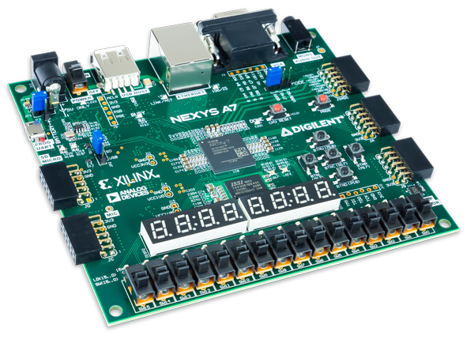
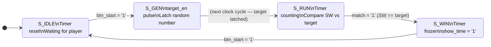

# Binary Perception Game

> **A FPGA reaction game — convert a random decimal number to binary before the clock runs out.**  
> Built in VHDL and tested on the **Digilent Nexys A7-50T**.

---

## 📋 Table of Contents

- [Overview](#overview)
- [Team](#team)
- [How to Play](#how-to-play)
- [Hardware](#hardware)
- [Architecture](#architecture)
  - [Top-Level Block Diagram](#top-level-block-diagram)
  - [FSM State Diagram](#fsm-state-diagram)
  - [Component Descriptions](#component-descriptions)
- [Display Layout](#display-layout)
- [Project Structure](#project-structure)
- [License](#license)

---

## Overview

The **Binary Perception Game** is an educational FPGA project that trains players to rapidly convert decimal numbers into binary. A random number between **0 and 255** is generated using a free-running 8-bit counter sampled at the moment the player presses start — giving a different target every round. The player uses the 8 on-board slide switches to enter the matching binary value while a timer counts up in 0.1-second steps. When the correct combination is entered the timer freezes and the elapsed time is displayed, showing your score.

The project demonstrates:
- Finite state machines in VHDL
- 7-segment display multiplexing (8 digits, ~1 kHz refresh)
- Binary-to-BCD and BCD-to-segment conversion pipelines
- Button debouncing
- Free-running counter as a pseudo-random source

---

## Team

| Name | Role |
|------|------|
| **Adam Uhlíř** |Main Programming Designer|
| **Gabriel Novák** |RTL Scheme + Debbuging|
| **Jan Ručka** |Presentation & Poster|
| **Simon Veselý** |GitHub Maintainer + Testbenches|

*Project developed as part of a BPC-DE1 digital electronics 1 course(VUT-FEKT) — 2026.*

---
## How to Play

| Step | Action | What you see |
|------|--------|-------------|
| **1** | Power on / reset | Left/Right displays show `000`|
| **2** | Press **BTNC** | Target number appears on the **left** 3 digits; timer starts counting up on background |
| **3** | Flip **SW[7:0]** | LEDs mirror your switch positions live; your current decimal value shown on right displays |
| **4** | Match the target | Timer freezes automatically — your time is your score! |
| **5** | Press **BTNC** again | Return to idle for a new round |
| **–** | Press **BTNR** or **CPU\_RESETN** at any time | Hard reset to idle |

> **Tip:** SW7 is the most-significant bit (128), SW0 is the least-significant bit (1).

---

## Hardware

| Resource | Usage |
|----------|-------|
| **Board** | Digilent Nexys A7-50T (`xc7a50ticsg324-1L`) |
| **SW[7:0]** | 8-bit binary input |
| **LED[7:0]** | Mirror of SW[7:0] — live binary feedback |
| **BTNC** | Start round / confirm next round |
| **BTNR** | Software reset (same effect as CPU\_RESETN) |
| **CPU\_RESETN** | Hardware reset (active-low) |
| **AN[7:0]** | 8× 7-segment anode enables (active-low, common-anode) |
| **CA–CG, DP** | Segment and decimal-point outputs |



---

## Architecture

### Top-Level Block Diagram

.png)

### FSM State Diagram



The FSM lives inside `Main_Game_logic.vhd`. Outputs are purely combinational:

| State | `target_en` | `show_time` | Display behaviour |
|-------|:-----------:|:-----------:|-------------------|
| S_IDLE | `0` | `0` | Right: `000`  Left:  `000` |
| S_GEN  | `1` | `0` | One-cycle latch pulse |
| S_RUN  | `0` | `0` | Right: live input  Left: target decimal |
| S_WIN  | `0` | `1` | Right: final time  Left: target decimal |

### Component Descriptions

#### `clk_en.vhd` — Clock Enable Generator
Produces a single-cycle `ce_1ms` pulse every **1 ms** from the 100 MHz system clock (counts to 100 000). All time-sensitive logic is gated on this enable rather than using a divided clock, keeping the design fully synchronous to one clock domain.

#### `debounce.vhd` — Button Debouncer
Watches `BTNC` and waits for it to be stable for **10 ms** before emitting a single-cycle `btn_press` pulse. Prevents the FSM from receiving multiple triggers from a single physical button press.

#### `counter.vhd` — Free-Running 8-bit Counter
Increments every clock cycle (100 MHz), completing a full 0–255 cycle every **2.56 µs**. When the player presses start, the current counter value is captured as the target — effectively random because human reaction time is orders of magnitude slower than the counter period.

The target is stored with a bit-scramble in the top level:
```vhdl
s_current_target <= not s_target_num(3 downto 0) & s_target_num(7 downto 4);
```
This swaps the nibbles and inverts the lower nibble, adding extra spread across the 0–255 range.

#### `Main_Game_logic.vhd` — Game FSM + Timer
Contains the 4-state FSM and a **10-bit timer** (`s_timer`, 0–999). The timer uses `ce_1ms` and an internal `s_ms_divider` (0–99) to produce a tick every **100 ms**, giving a display resolution of **0.1 s** and a maximum displayable time of **99.9 s**.

BCD conversion of the timer is done combinationally using integer division (synthesises correctly in Vivado for this range):
```vhdl
time_bcd_h <= to_unsigned(t / 100,        4);
time_bcd_t <= to_unsigned((t rem 100) / 10, 4);
time_bcd_u <= to_unsigned(t rem 10,       4);
```

#### `bin_2_bcd.vhd` — Binary to BCD Converter
Converts an 8-bit binary value (0–255) into three 4-bit BCD digits (hundreds, tens, units) using integer division. Two instances run in parallel — one for the target number, one for the live switch value.

#### `Multiplexor.vhd` — 8-Digit Display Multiplexer
A 3-bit counter advances through display slots at 1 ms per slot (~125 Hz per digit, well above flicker threshold). Only 6 of the 8 slots are used:

| Slot (`cnt`) | Anode | Content |
|:---:|:---:|---|
| `000` | AN0 | Switch/timer — units |
| `001` | AN1 | Switch/timer — tens *(decimal point active in S\_WIN)* |
| `010` | AN2 | Switch/timer — hundreds |
| `011`, `100` | — | Unused (blank) |
| `101` | AN5 | Target — units |
| `110` | AN6 | Target — tens |
| `111` | AN7 | Target — hundreds |

During `S_RUN` the **right side** shows the player's live switch value in decimal. During `S_WIN` the right side switches to the frozen elapsed time and `show_time` enables the left side to reveal the target.

#### `bin_2_seg.vhd` — BCD to 7-Segment Decoder
Look-up table mapping 4-bit BCD (0–9) to the 7-segment encoding for the Nexys A7's **common-anode** display (active-low segments). Any input outside 0–9 maps to `1111111` (all segments off), used as the blank state.

---

## Display Layout

```
  AN7   AN6   AN5       AN2   AN1   AN0
┌─────┐┌─────┐┌─────┐  ┌─────┐┌─────┐┌─────┐
│     ││     ││     │  │     ││     ││     │
│  T  ││  T  ││  T  │  │  V  ││  V  ││  V  │
│  G  ││  G  ││  G  │  │  A  ││  A  ││  A  │
│  T  ││  T  ││  T  │  │  L  ││  L ●││  L  │
└─────┘└─────┘└─────┘  └─────┘└─────┘└─────┘
  100s   10s    1s        10s    1s    0.1s
   └────── Target ──────┘  └─── Timer / Value ───┘
                                         ▲
                               Decimal point (●) active
                               in S_WIN between 1s and 0.1s

S_RUN : Right = current SW value in decimal
S_WIN : Right = elapsed time  │  Left = target number (revealed!)
```

---

## Project Structure

```
Binary_Perception_Game/
│
├── Binary_Perception_Game.srcs/
│   ├── sources_1/new/                    # Design sources
│   │   ├── Binary_Perception_Game.vhd    #   Top-level entity
│   │   ├── Main_Game_logic.vhd           #   Game FSM + timer
│   │   ├── Multiplexor.vhd               #   8-digit display multiplexer
│   │   ├── bin_2_bcd.vhd                 #   Binary → BCD converter
│   │   └── bin_2_seg.vhd                 #   BCD → 7-segment decoder
│   │
│   ├── sources_1/imports/                # Imported lab components
│   │   ├── .../counter/                  #   clk_en.vhd, counter.vhd
│   │   ├── .../debounce/                 #   debounce.vhd
│   │   └── new/bin2seg.vhd               #   (legacy bin2seg reference)
│   │
│   ├── sim_1/new/                        # Testbenches (XSim)
│   │   ├── bin_2_bcd_tb.vhd
│   │   ├── bin_2_seg_tb.vhd
│   │   ├── clk_en_tb.vhd
│   │   ├── counter_tb.vhd
│   │   ├── debounce_tb.vhd
│   │   ├── Main_Game_Logic_tb.vhd
│   │   └── Multiplexor_tb.vhd
│   │
│   └── constrs_1/new/
│       └── nexys.xdc                     # Nexys A7-50T pin assignments
│
├── additional_sources/
│   └── components_from_lab/              # Reference components from labs
│       ├── clk_en.vhd
│       ├── counter.vhd, counter_top.vhd
│       ├── debounce.vhd
│       ├── debounce_counter_top.vhd
│       ├── debounce_counter_second_top.vhd
│       ├── display_driver.vhd, display_top.vhd
│       ├── bin2seg.vhd, segment_top.vhd
│       ├── comparator.vhd
│       ├── gates.vhd
│       └── demorgan.vhd
│
├── images/
│   ├── nexys-a7-50t-board.png
│   └── scheme.png
│
├── Binary_Perception_Game.xpr           # Vivado project file
├── LICENSE
└── README.md
```

### Building in Vivado

1. Create a new **RTL project** targeting `xc7a50ticsg324-1L`
2. Add all `.vhd` files from `src/` as design sources
3. Add `Binary_Perception_Game.xdc` as a constraint source
4. Set `Binary_Perception_Game_Top` as the top module
5. Run **Generate Bitstream** (Synthesis → Implementation → Bitstream)
6. Program the board via **Open Hardware Manager**

---


## License

This project is licensed under the **MIT License** — see the [LICENSE](LICENSE) file for details.
